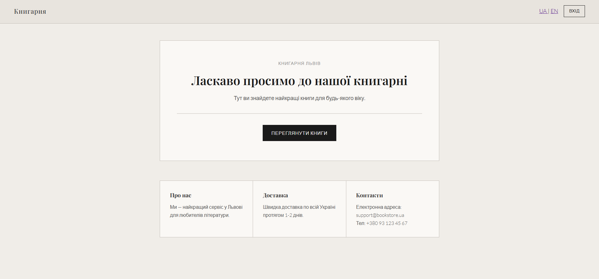
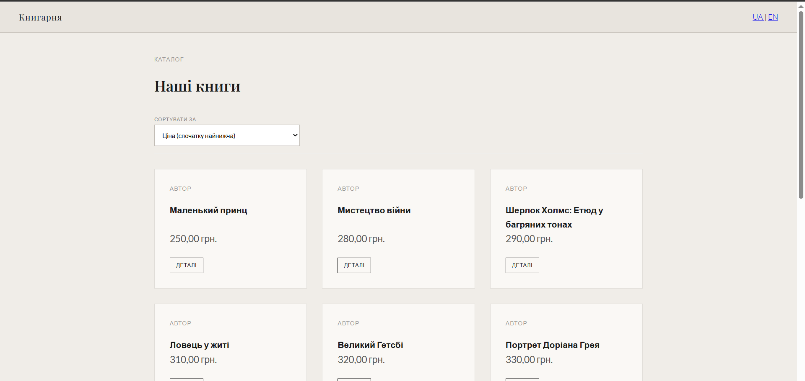
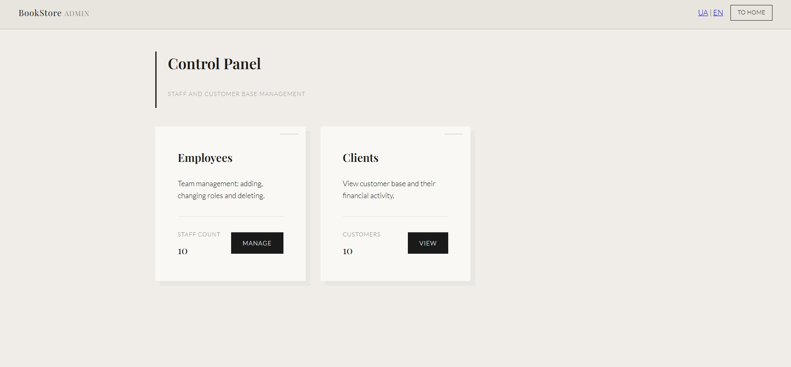
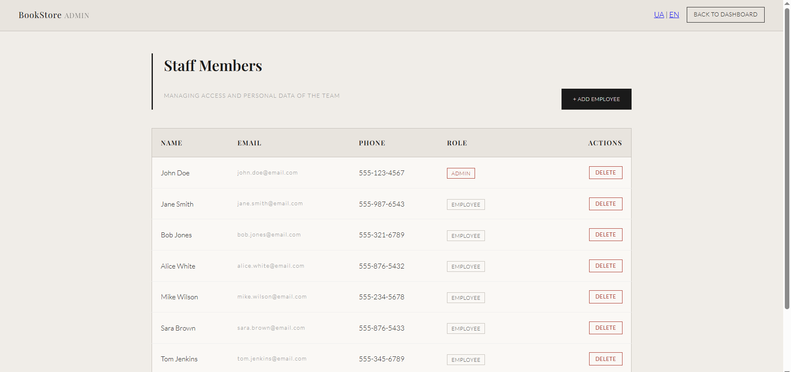
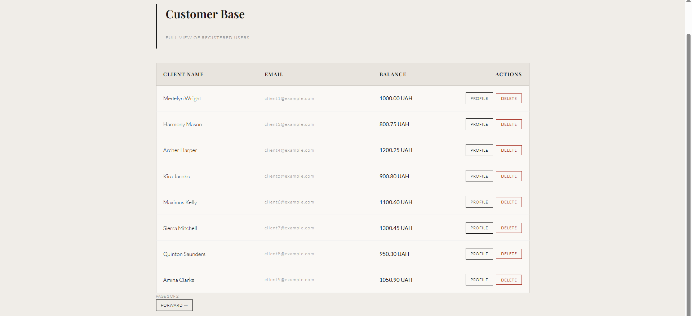
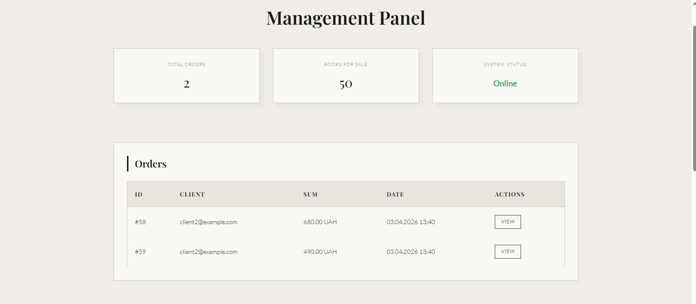
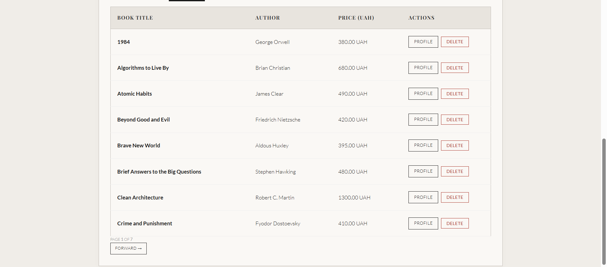
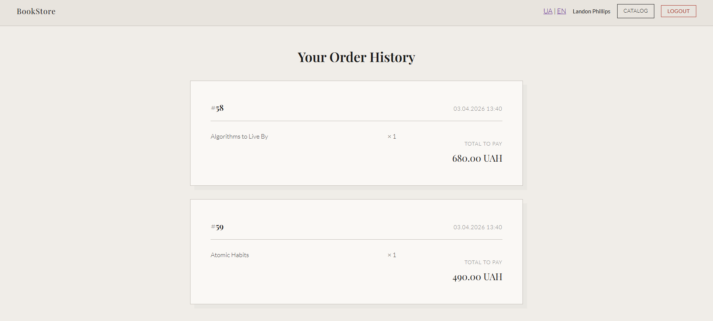
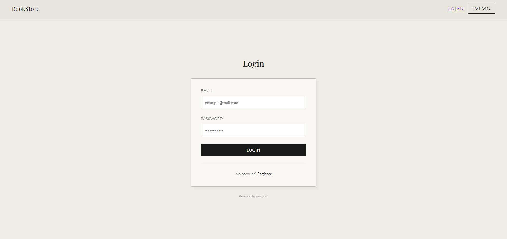
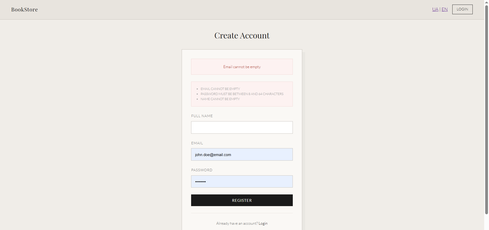

# BookStore: Library & Bookstore Management System

BookStore Service is a full-stack web application for managing a library and an online bookstore.  
This project demonstrates practical experience with Java 21 , secure architecture, and relational databases.


## Tech Stack

- Backend: Java 21, Spring Boot 3.x, Spring Data JPA, Hibernate
- Security: Spring Security (Session-based, Role-Based Access Control)  
- Database: PostgreSQL (Supabase), H2 (for local testing)  
- Frontend: Thymeleaf, CSS3 
- Tools: Maven, Lombok, Bean Validation, i18n (UA/EN)


## Features

- Role-Based Access Control: Clear separation of permissions for ADMIN, EMPLOYEE, and CLIENT roles  
- Smart Catalog: Dynamic sorting and pagination using Spring Data Pageable for efficient data handling  
- Full CRUD: Admin panel for managing books, orders, and employees  
- Internationalization (i18n): Support for Ukrainian and English with dynamic language switching  
- Financial Logic: Client balance system with validation and order history  


## Screenshots

<details>
  <summary>Click to expand screenshots</summary>

  ### Home Page
  

  ### Book Catalog
  

  ### Book Details
  

  ### Admin Dashboard
  
  
  

  ### User And Book Management
  
  

  ### Orders
  

  ### Authentication
  
  


</details>


## Getting Started

1. Clone the repository:

```bash
git clone https://github.com/Alexxandrorez/bookstore-service.git

2. Navigate to the project folder:
Bash
cd bookstore-service

3. Run the application using Maven:
Bash
mvn spring-boot:run
The application will be available at: http://localhost:8084
